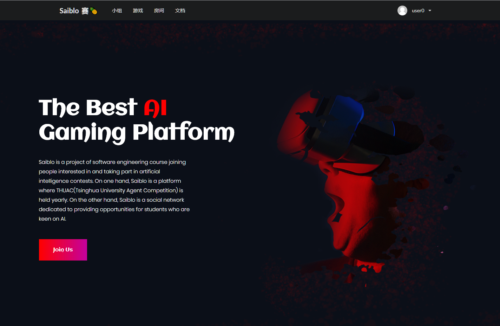
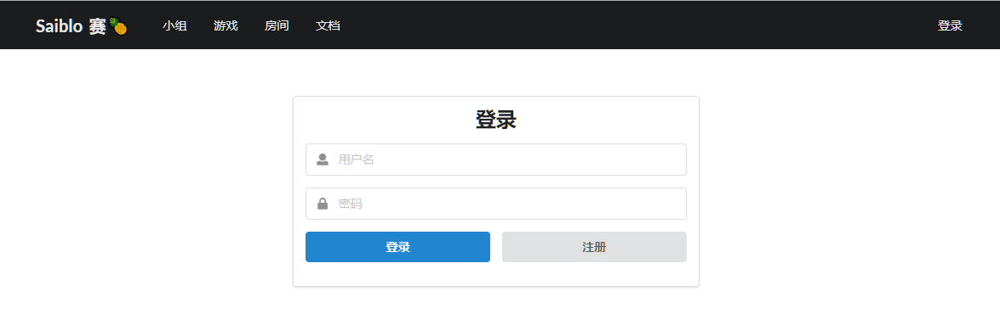

# 网站前端

Author : [fnoi2014xtx](https://github.com/fnoi2014xtx)

[TOC]

## 概述

Saiblo 网站前端使用[Nuxt.js](https://nuxtjs.org/) 框架，[Nuxt.js](https://nuxtjs.org/) 是一个基于[Vue.js](https://vuejs.org/) 的通用应用框架，使用服务器渲染技术([SSR](https://ssr.vuejs.org/#about-this-guide))，来加速网页的打开速度。

Nuxt.js 主要在以下几点上与 Vue.js有所区别

- Vue单页面应用渲染是从服务器获取所需js，在客户端将其解析生成html挂载于 id为app的DOM元素上，这样会存在两大问题：由于资源请求量大，造成网站首屏加载缓慢，不利于用户体验；由于页面内容通过js插入，对于内容性网站来说，搜索引擎无法抓取网站内容，不利SEO。Nuxt.js 可以将html在服务端渲染，合成完整的html文件再输出到浏览器。
- Nuxt.js 按照 pages 文件夹的目录结构自动生成路由，Vue.js 需在 src/router/index.js 手动配置路由
- Nuxt.js 页面入口为 layouts/default.vue，Vue.js页面入口为 src/App.vue
- Nuxt.js 内置webpack，允许根据服务端需求，在 nuxt.config.js 中的build属性自定义构建webpack的配置，覆盖默认配置Vue关于webpack的配置存放在build文件夹下

Nuxt.js 响应一次请求的流程如下

Saiblo网站前端主要分为以下几个部分

- 用户管理系统：包括用户的登录、用户信息详情，修改用户信息，注册等等
- 小组管理系统：包括小组列表，小组详情菜单，小组管理页面等等
- 房间系统
- 比赛系统
- 游戏系统
- 代码管理系统

## 网站首页/网站入口

### index.vue

| 参数 | 值                  |
| ---- | ------------------- |
| 地址 | `/`                 |
| 用途 | 网站首页，用于宣传  |
| 权限 | 游客                |
| 预览 |  |

## 用户管理系统

### login.vue

| 参数 | 值                  |
| ---- | ------------------- |
| 地址 | `/login`            |
| 用途 | 用户登录界面        |
|权限|游客|
| 预览 |  |

### register.vue

| 参数 | 值                     |
| ---- | ---------------------- |
| 地址 | `/register`            |
| 用途 | 用户注册界面           |
|权限|游客|
| 预览 |  |

### forget_password.vue

| 参数 | 值                     |
| ---- | ---------------------- |
| 地址 | `/forget_password`            |
| 用途 | 用户忘记密码后进行邮箱验证           |
|权限|游客|
| 预览 |  |

### reset_password.vue

| 参数 | 值                     |
| ---- | ---------------------- |
| 地址 | `/reset_password`            |
| 用途 | 用户忘记密码后进行邮箱验证，验证成功后重置密码           |
|权限|登录用户|
| 预览 |  |

### profile.vue

| 参数 | 值                     |
| ---- | ---------------------- |
| 地址 | `/profile`            |
| 用途 | 个人资料界面           |
|权限|登录用户|
| 预览 |  |

### edit_profile.vue

| 参数 | 值                         |
| ---- | -------------------------- |
| 地址 | `/edit_profile`            |
| 用途 | 修改相关的个人资料         |
| 权限 | 登录用户                   |
| 预览 |  |

### user/_id.vue

| 参数 | 值                         |
| ---- | -------------------------- |
| 地址 | `/user/<username>`            |
| 用途 | 查看username用户的相关资料         |
| 权限 | 登录用户                   |
| 预览 |  |

## 小组系统

### groups.vue

| 参数 | 值                         |
| ---- | -------------------------- |
| 地址 | `/groups`           |
| 用途 | 查看所有的小组         |
| 权限 | 游客                   |
| 预览 |  |

### admin_groups.vue

| 参数 | 值                         |
| ---- | -------------------------- |
| 地址 | `/admin_groups`           |
| 用途 | 超级管理员用于管理所有小组         |
| 权限 | 超级管理员                   |
| 预览 |  |

### groups/_id.vue

| 参数 | 值                         |
| ---- | -------------------------- |
| 地址 | `/groups/<group id>`           |
| 用途 | 查看编号为group id的小组的详细信息         |
| 权限 | 登录用户                   |
| 预览 |  |

### groups/_slug/manage.vue

| 参数 | 值                         |
| ---- | -------------------------- |
| 地址 | `/groups/<group id>/manage`           |
| 用途 | 管理小组编号为group id的小组的信息，包括加入权限，发布公告，成员管理，比赛管理等等   |
| 权限 | 该小组的小组管理员                   |
| 预览 |  |

## 游戏系统

### games.vue

| 参数 | 值                         |
| ---- | -------------------------- |
| 地址 | `/games`           |
| 用途 | 查看所有已经部署的游戏   |
| 权限 | 登录用户                   |
| 预览 |  |

### game/_id.vue

| 参数 | 值                         |
| ---- | -------------------------- |
| 地址 | `/game/<game id>`           |
| 用途 | 查看编号为game id的游戏的详细信息   |
| 权限 | 登录用户                   |
| 预览 |  |

### game/_slug/edit.vue

| 参数 | 值                         |
| ---- | -------------------------- |
| 地址 | `/game/<game id>/edit`           |
| 用途 | 修改编号为game id的游戏的详细信息   |
| 权限 | 超级管理员                   |
| 预览 |  |

### game/_slug/ranklist.vue

| 参数 | 值                         |
| ---- | -------------------------- |
| 地址 | `/game/<game id>/ranklist`           |
| 用途 | 查看编号为game id游戏绑定的排行榜   |
| 权限 | 登录用户                   |
| 预览 |  |

### match/_id.vue

| 参数 | 值                         |
| ---- | -------------------------- |
| 地址 | `/match/<match id>`           |
| 用途 | 查看对局编号为match id的对局详情，如果有HTML播放器则回放  |
| 权限 | 登录用户                   |
| 预览 |  |

## 代码管理系统

### edit_code.vue

| 参数 | 值                         |
| ---- | -------------------------- |
| 地址 | `/edit_code`           |
| 用途 | 管理自己提交的代码   |
| 权限 | 登录用户                   |
| 预览 |  |

## 比赛管理系统

### group/\_slug/contest/\_id.vue

| 参数 | 值                         |
| ---- | -------------------------- |
| 地址 | `/group/<group id>/contest/<contest id>`           |
| 用途 | 查看group id小组下属的编号为contest id的比赛   |
| 权限 | 登录用户                   |
| 预览 |  |

### group/\_slug/contest/\_id.vue

| 参数 | 值                         |
| ---- | -------------------------- |
| 地址 | `/group/<group id>/contest/<contest id>/ranklist`           |
| 用途 | 查看group id小组下属的编号为contest id的比赛的排行榜   |
| 权限 | 登录用户                   |
| 预览 |  |

## 房间系统

### rooms.vue

| 参数 | 值                         |
| ---- | -------------------------- |
| 地址 | `/rooms`           |
| 用途 | 查看当前的所有房间 |
| 权限 | 登录用户               |
| 预览 |  |
